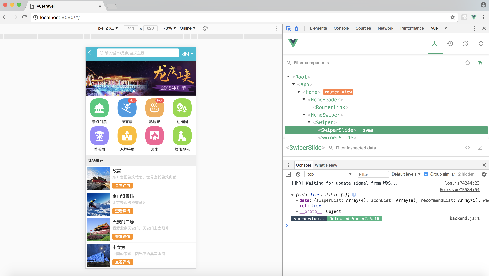
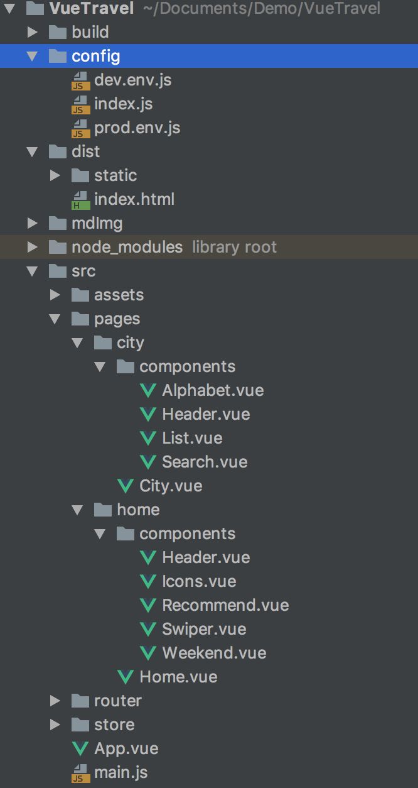
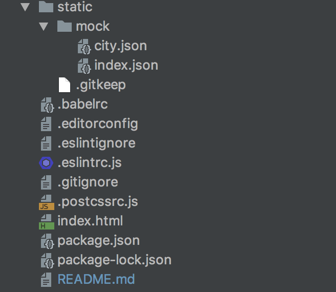

# VueTravel

## Vue全家桶介绍：
### “简单却不失优雅，小巧而不乏大匠”。
#### Vue.js 是一个JavaScriptMVVM库，是一套构建用户界面的渐进式框架。它是以数据驱动和组件化的思想构建的，采用自底向上增量开发的设计。相比于Angular.js，Vue.js提供了更加简洁、更易于理解的API，使得我们能够快速地上手并使用Vue.js；同时比起 React + Redux 相对复杂的架构，Vue.js 更加轻量级也更加容易上手，是初创项目的首选前端框架。Vue 的核心库只关注视图层，它不仅易于上手，还便于与第三方库或既有项目整合。并且作者是华人的关系，Vue拥有着对华人开发者最友好的api文档和官方教程。
#### Vue有著名的全家桶系列，包含了vue-router（http://router.vuejs.org），vuex（http://vuex.vuejs.org）， vue-resource（https://github.com/pagekit/vue-resource）。再加上构建工具vue-cli，就是一个完整的vue项目的核心构成。
#### 1、vue-router路由：通过import导入并定义Vue模块、vue-router模块和需要使用的组件
#### 2、vuex状态管理：Vuex 是一个专为 Vue.js 应用程序开发的状态管理模式。它采用集中式存储管理应用的所有组件的状态，并以相应的规则保证状态以一种可预测的方式发生变化。
#### 3、vue-resource介绍：Vue-resource有体积小，支持IE9以上的浏览器，支持promise特性的特点。同样推荐使用npm来安装Vue-resource。在安装并引入vue-resource后，可以基于全局的Vue对象使用http，也可以基于某个Vue实例使用http。（该git项目没有使用vue-resource，使用axios做网络请求）

### 调试插件
#### 在vue调试方面，可以选择安装chrome插件vue Devtools。打开vue项目，在console控制台选择vue面板。在Devtools工具中，可以选择组件，查看对应组件内的数据信息。也可以选择Vuex选项，查看该项目内Vuex的状态变量信息。

### Vue上推荐的UI库
#### 1、Element

#### 2、iView

#### 参考链接 https://blog.csdn.net/zhenghao35791/article/details/67639415
#### http://baijiahao.baidu.com/s?id=1564621978525392&wfr=spider&for=pc

## 项目描述：
### 1、项目基于Vue2.5.2
### 2、主要组件有axios0.18.0、vue-router3.0.1、webpack3.6.0、vuex3.0.1
### 3、该项目适用于手机web页面，一个webApp，参考去哪儿网
### 4、网络接口为本地static文件夹下mock下的.json文件

## 环境安装：
### 1、环境要求
#### node >= 6.0.0 && npm >= 3.0.0

### 2、windows node及npm环境安装
#### windows下的NodeJS安装是比较方便的（v0.6.0版本之后，支持windows native），只需要登陆官网 http://nodejs.org 便可以看到首的“INSTALL”按钮，直接点击就会自动下载安装了
#### 安装过程基本直接“NEXT”就可以了。（windows的安装msi文件在过程中会直接添加path的系统变量，变量值是你的安装路径，例如“C:\Program Files\nodejs”）。
#### 安装完成后可以使用cmd（win+r然后输入cmd进入）测试下是否安装成功。方法：在cmd下输入node -v，出现版本提示就是完成了NodeJS的安装。
#### npm的安装。由于新版的NodeJS已经集成了npm，所以之前npm也一并安装好了。同样可以使用cmd命令行输入"npm -v"来测试是否成功安装，出现版本提示便OK了。
#### 然后我们要先配置npm的全局模块的存放路径以及cache的路径，例如我希望将以上两个文件夹放在NodeJS的主目录下，便在NodeJs下建立"node_global"及"node_cache"两个文件夹。
#### 启动cmd，输入npm config set prefix "C:\Program Files\nodejs\node_global"以及npm config set cache "C:\ProgramFiles\nodejs\node_cache"
#### 现在我们来装个模块试试，选择express这个比较常用的模块。同样在cmd命令行里面，输入“npm install express -g”（“-g”这个参数意思是装到global目录下，也就是上面说设置的“C:\Program Files\nodejs\node_global”里面。）。待cmd里面的安装过程滚动完成后，会提示“express”装在了哪、版本还有它的目录结构是怎样。
#### 关闭cmd，打开系统对话框，“我的电脑”右键“属性”-“高级系统设置”-“高级”-“环境变量”。
#### 进入环境变量对话框，在系统变量下新建"NODE_PATH"，输入”C:\Program Files\nodejs\node_global\node_modules“。（ps：这一步相当关键。）2014.4.19新增：由于改变了module的默认地址，所以上面的用户变量都要跟着改变一下（用户变量"PATH"修改为“C:\Program Files\nodejs\node_global\”），要不使用module的时候会导致输入命令出现“xxx不是内部或外部命令，也不是可运行的程序或批处理文件”这个错误。
#### 参考链接：https://blog.csdn.net/xxmeng2012/article/details/51492149

### 3、MacOS node及npm环境安装
#### 自行搜索

## 项目结构及学习笔记：
 
### 1、config文件夹
### 2、dist文件夹
### 3、nodel_modules文件夹
### 4、src文件夹
### 5、router文件夹
### 6、store文件夹
### 7、static文件夹
### 8、.gitignore文件
### 9、package.json文件
### 10、README.md文件
### 11、

## 项目运行：
### 1、项目下载
  使用git下载 git clone 或者直接下载文件包
### 2、项目依赖安装和运行
  npm install
  npm run start 或者 npm run dev

**********************
## 新建项目指南：
1、vue安装
### 最新稳定版
$ npm install vue

2、命令行工具 (CLI)
### 全局安装 vue-cli
$ npm install --global vue-cli
### 创建一个基于 webpack 模板的新项目
$ vue init webpack my-project
### 创建项目并运行
$ cd my-project
$ npm run dev
